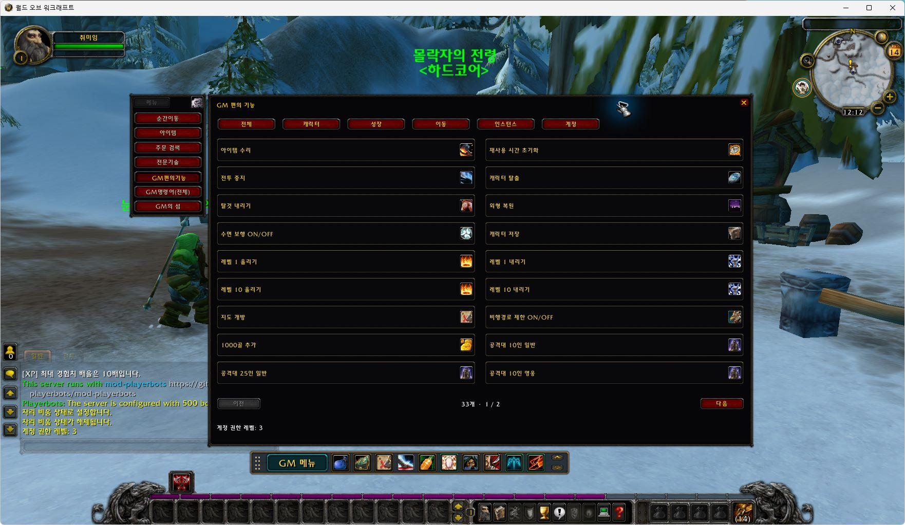
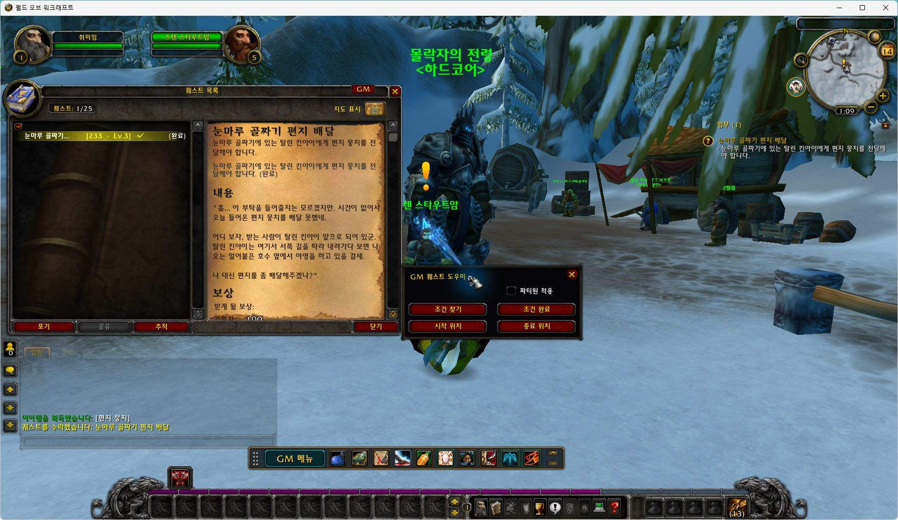
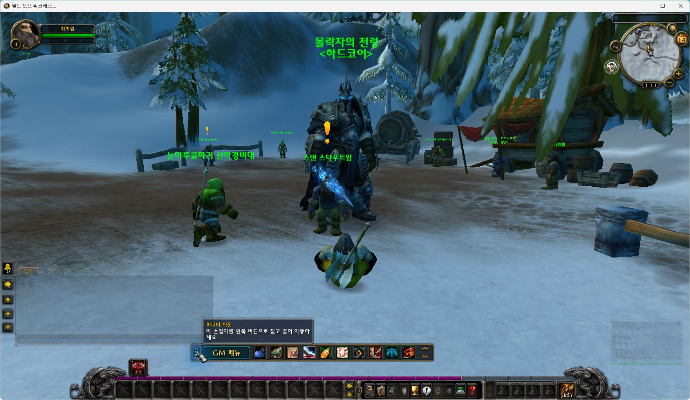
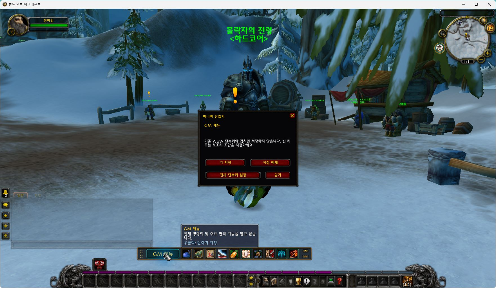
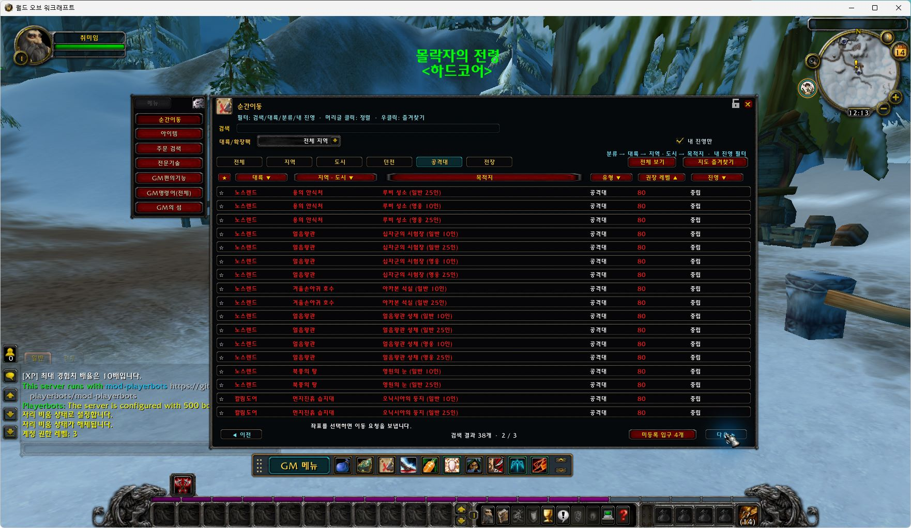
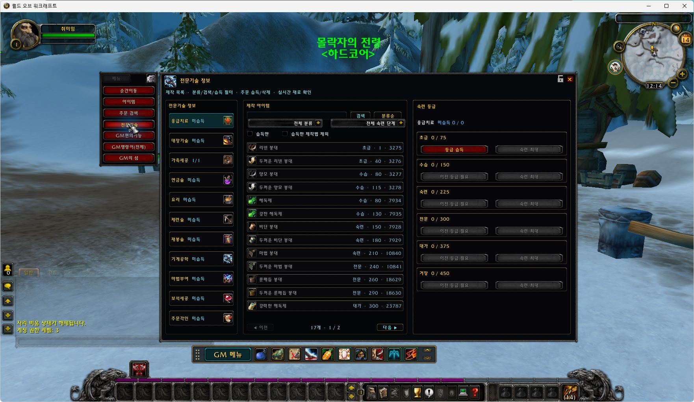
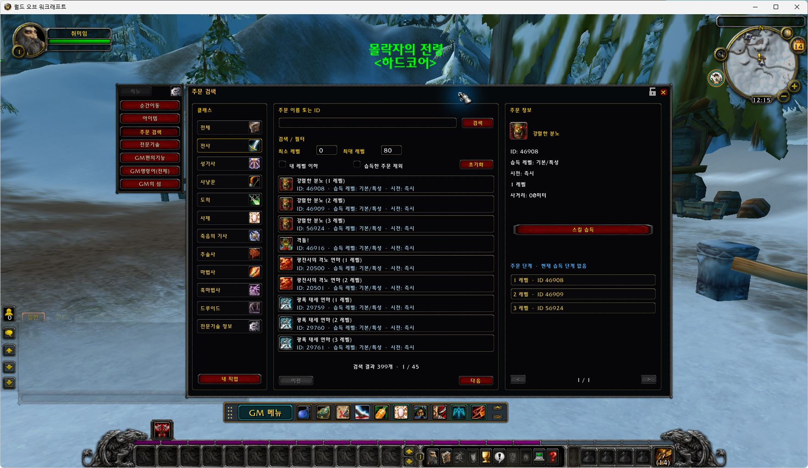
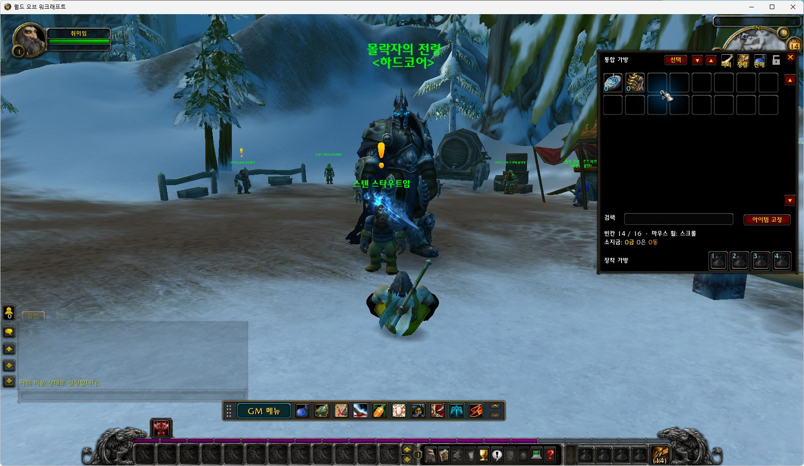

# GM MINI BAR — 판다리아의 안개 · SkyFire

**[English](README.md) | [한국어](README.ko.md)**

**WoW 5.4.8 (18414) / SkyFire용 GM 애드온**입니다. 개인 서버의 운영·테스트에 필요한 검색, 이동, 퀘스트, 캐릭터 관리 기능을 WoW 방식의 UI로 제공합니다. 제작: **취미연구가** · 현재 배포: **v1.0.0**.

한국어·영어·중국어 간체·중국어 번체·러시아어 UI와 클라이언트 언어 자동 선택을 지원합니다.

**[설치 ZIP 다운로드](https://github.com/hilch1981-prog/mop-gm-addon/releases/download/v1.0.0/GMminibar_MoP_5.4.8_v1.0.0.zip)** · [릴리스 안내](https://github.com/hilch1981-prog/mop-gm-addon/releases/tag/v1.0.0) · [오류 제보](https://github.com/hilch1981-prog/mop-gm-addon/issues)

[](https://github.com/hilch1981-prog/mop-gm-addon/actions/workflows/validate.yml)

**사진 안내:** 이 문서의 스크린샷은 **리치왕 3.3.5a / WOW Legends Repack 1.5.3에서 촬영한 UI 참고 화면**입니다. MoP에서 촬영한 화면이나 해당 버전의 동작 검증 자료가 아닙니다. 기능과 조작은 이 저장소의 버전에 맞춘 아래 설명을 확인하세요.



*리치왕 UI 참고 — GM 편의 기능: 두 열의 아이콘 버튼과 기능별 분류*

## 설치와 실행

1. **WoW 5.4.8 (18414)**에 맞는 위의 설치 ZIP을 받고 게임을 종료합니다.
2. 압축을 풀어 **GMminibar 폴더 하나**를 게임의 `Interface/AddOns` 안에 넣습니다.
3. 최종 경로가 `Interface/AddOns/GMminibar/GMminibar.toc`인지 확인합니다.
4. 애드온 선택 화면에서 해당 버전의 **GM MINI BAR**를 켠 뒤 캐릭터로 접속합니다.
5. 미니바의 **GM 메뉴** 또는 `/aamop` 명령으로 창을 엽니다.

GitHub의 **Source code (zip / tar.gz)**는 개발용입니다. 일반 설치에는 **설치 ZIP 하나**를 사용하세요. 내부의 Fonts·Data 등은 애드온의 하위 자료이며 별도 애드온이 아닙니다.

별도 **MPQ·DLL·SQL 설치는 필요하지 않습니다.** 게임 전체 한글화나 서버·클라이언트 설치 파일은 포함하지 않습니다. GM 명령을 사용하려면 해당 서버에서 필요한 권한이 있어야 합니다.

다른 GM 애드온과 기능이 겹치면 중복되는 애드온을 꺼 주세요. 기존 설정을 유지하려면 `WTF` 폴더를 지우지 마세요.

## 언어 지원과 전환

상단 **English / 한국어** 링크로 문서 언어를 바꿉니다. 게임 안에서는 **톱니바퀴 설정의 언어 버튼**으로 애드온 UI 언어를 선택합니다. 설정에서 언어를 바꾸면 UI를 다시 불러옵니다.

| 버튼 | 언어 코드 | 언어 |
|---|---|---|
| AUTO | auto | 클라이언트 언어 자동 선택 |
| KO | koKR | 한국어 / Korean |
| EN | enUS | 영어 / English |
| CN | zhCN | 중국어 간체 / 简体中文 |
| TW | zhTW | 중국어 번체 / 繁體中文 |
| RU | ruRU | 러시아어 / Русский |

명령으로도 선택할 수 있습니다:

```text
/aamop locale enUS
/aamop locale koKR
/aamop locale auto
```

자동 선택에서 지원하지 않는 클라이언트 언어는 영어로 표시합니다. 번역되지 않은 항목은 영어 또는 원문으로 남을 수 있습니다. 아이템·주문 이름과 서버 메시지의 언어는 클라이언트·서버 자료의 영향을 받으며, UI 언어 선택이 게임 전체를 번역하는 기능은 아닙니다.

## 주요 기능

| 기능 | 설명 |
|---|---|
| GM 메뉴·편의 기능 | 두 열의 아이콘 버튼과 분류. 레벨 ±1/±10, 수리, 회복·부활, 전투 중지, 탈것 내리기, 외형 복원, 수면 보행, 지도 개방, 숙련 최대, 소환·대상에게 이동 등. |
| 아이템 검색 | 이름·ID로 아이템을 찾고 정보를 확인한 뒤 지급합니다. |
| 주문 검색 | 주문 정보·단계·습득 상태를 표시하고 습득 필터와 배우기 기능을 제공합니다. |
| 전문기술 | 제작법과 등급을 조회합니다. 앞 등급을 배운 뒤 다음 등급으로 진행하며, 습득 상태에 따라 등급 습득·숙련 최대 버튼이 갱신됩니다. |
| 순간이동 | 대륙·지역/도시·목적지·레벨을 기준으로 찾고 레벨 순 정렬과 즐겨찾기를 사용합니다. |
| 퀘스트 도우미 | 기본 퀘스트 창 옆에서 조건 찾기·조건 완료·시작/종료 위치 이동과 파티원 적용을 사용합니다. |
| 통합 가방 | 아이템 사용·이동, 검색·정렬·고정과 장착 가방 4칸을 제공합니다. 열린 상태에서 추가 가방을 넣거나 교체할 수 있습니다. |

**GM 편의 기능 창의 클릭 규칙:** 지원되는 기능은 왼쪽 클릭으로 본인에게, 오른쪽 클릭으로 선택한 플레이어에게 적용합니다. 대상이 없으면 캐릭터명을 입력합니다. 본인 전용 기능과 대상 선택이 필요한 기능은 화면 안내를 따릅니다.

통합 가방은 톱니바퀴 설정의 **통합 가방 사용**을 켠 뒤 가방 단축키 **B**로 엽니다. 미니바의 가방 아이콘은 **은행 열기**입니다.

## 순간이동 목적지

| 종류 | 도착 지점 |
|---|---|
| 여관·비행경로 | 여관 주인 또는 비행 조련사 NPC 위치 |
| 던전·공격대 | 만남의 돌 옆 착지 지점 또는 외부 포탈 입구 |
| 전장 | 해당 전장의 외부 입구 |

인스턴스가 지원하는 인원수와 일반·영웅 난이도를 별도 항목으로 표시합니다. 예를 들어 오닉시아의 둥지는 지원되는 10인·25인 항목으로 구분합니다. 모든 공격대가 모든 난이도를 지원하는 것은 아닙니다.

보고된 던전·전장 입구에는 착지 좌표 보정을 반영했습니다. **아졸네룹과 안카헤트는 공용 만남의 돌 옆 동굴 입구 주변**으로 이동합니다. 확인한 환경과 남은 시험 범위는 아래 검증 안내를 참고하세요.

## 퀘스트 도우미 사용법

미니바의 **책 아이콘** 또는 **L 키**로 기본 퀘스트 창을 열고 진행 중인 퀘스트를 선택합니다.

| 버튼 | 기능 |
|---|---|
| 조건 찾기 | 자료가 있는 목표 위치로 이동합니다. 목표가 여러 개면 클릭할 때마다 순서대로 찾습니다. |
| 조건 완료 | 선택한 퀘스트의 목표 조건 완료를 서버에 요청합니다. NPC 보상 수령은 별도로 진행합니다. |
| 시작 위치 | 퀘스트를 주는 NPC 위치로 이동합니다. |
| 종료 위치 | 완료 보고를 받는 NPC 위치로 이동합니다. |



*리치왕 UI 참고 — 기본 퀘스트 창 옆 GM 퀘스트 도우미*

### 파티원 적용

기본값은 본인에게만 적용입니다. 체크하면 **같은 퀘스트를 가진 접속 중인 파티원**에게도 조건 완료를 요청합니다. 이동은 **본인이 먼저 도착한 것을 확인한 뒤 파티원을 같은 위치로 소환**합니다. 도착을 확인할 수 없으면 파티원 이동을 중단합니다.

체크만으로 실행되지는 않습니다. 퀘스트 선택과 위치 자료가 필요하며 서버의 GM 권한·인스턴스 입장·소환 조건이 적용됩니다.

## 미니바 슬롯 안내

왼쪽부터 오른쪽 순서입니다. **GM 메뉴를 포함해 11개 기능 슬롯**이며 이동 손잡이와 ▲/▼ 크기 조절 버튼은 별도입니다.

| 순서 | 슬롯 | 동작 |
|---|---|---|
| 1 | GM 메뉴 | GM 메뉴 창을 열거나 닫습니다. |
| 2 | 은행 열기 | 은행 창을 엽니다. |
| 3 | 퀘스트 도우미 | 기본 퀘스트 창과 도우미를 엽니다. |
| 4 | 순간이동 목록 | 목적지 검색·분류 목록을 엽니다. |
| 5 | 부활 | 본인이 죽었으면 본인에게 적용합니다. 살아 있으면 선택한 플레이어에게, 플레이어 대상이 없으면 본인에게 적용합니다. |
| 6 | GM 모드 | GM 모드를 켜거나 끕니다. |
| 7 | 무적 모드 | 무적 상태를 켜거나 끕니다. |
| 8 | 은신 | 일반 은신 효과를 전환합니다. 공격·전투 등으로 해제될 수 있습니다. |
| 9 | 대상 처치 | 선택한 대상을 즉시 처치합니다. 실행 전에 대상을 확인하세요. |
| 10 | 비행 모드 | GM 비행을 켜거나 끕니다. |
| 11 | 이동속도 | 기본 속도와 3배 속도를 전환합니다. |



*리치왕 UI 참고 — 미니바 전체 슬롯과 이동 손잡이 안내*

**이동·크기:** 맨 왼쪽 손잡이를 왼쪽 버튼으로 잡고 끌어 이동합니다. 맨 오른쪽 ▲/▼ 버튼으로 크기를 5%씩 확대·축소합니다.

### 단축키 지정

미니바 슬롯은 **왼쪽 클릭으로 실행, 오른쪽 클릭으로 단축키 지정** 창을 엽니다. ‘키 지정’을 누른 뒤 키 또는 Ctrl·Alt·Shift 조합을 입력합니다. ‘지정 해제’로 해제하고 ‘전체 단축키 설정’에서 목록을 엽니다. 기존 WoW 단축키와 충돌하면 저장하지 않습니다.

**GM 편의 기능 창의 오른쪽 클릭(다른 플레이어 적용)과 미니바의 오른쪽 클릭(단축키 지정)을 구분해 주세요.** 은신·이동속도처럼 본인 대상이 필요한 기능은 다른 대상을 해제하거나 본인을 선택한 뒤 사용합니다.



*리치왕 UI 참고 — 미니바 오른쪽 클릭 단축키 지정 창*

## 추가 화면

**사진 안내:** 이 문서의 스크린샷은 **리치왕 3.3.5a / WOW Legends Repack 1.5.3에서 촬영한 UI 참고 화면**입니다. MoP에서 촬영한 화면이나 해당 버전의 동작 검증 자료가 아닙니다. 기능과 조작은 이 저장소의 버전에 맞춘 아래 설명을 확인하세요.

<details>
<summary>순간이동·전문기술·주문·가방 화면 펼치기</summary>



*리치왕 UI 참고 — 순간이동: 공격대 인원수와 일반·영웅 난이도 구분*



*리치왕 UI 참고 — 전문기술: 제작법 목록과 순차 등급 습득*



*리치왕 UI 참고 — 주문 검색: 주문 정보와 주문 단계*



*리치왕 UI 참고 — 통합 가방: 검색·정렬·고정과 장착 가방 4칸*


*리치왕 UI 참고 — 퀘스트 도우미: 파티원 적용 안내*

</details>

## 확인 범위

**현재 배포본의 실제 MoP 게임 확인은 남아 있습니다.** Lua 5.1 구문·TOC/XML 의존성·전체 로딩·자체 검사 및 순간이동 난이도·가방 모의 검사를 수행했습니다. MoP 지형 자료와 원본 위치를 대조했지만 실제 게임 시험을 대신하지 않습니다.

자동 검사와 실제 게임 확인은 구분합니다. 서버 코어·리팩·DB·권한에 따라 결과가 달라질 수 있으며 모든 환경·명령·목적지의 전수 검증을 의미하지 않습니다. [검증 안내](docs/VALIDATION_KO.md)에서 세부 범위를 확인하세요.

## 오류 제보와 업데이트

[GitHub Issues](https://github.com/hilch1981-prog/mop-gm-addon/issues) 또는 [디스코드](https://discord.gg/FqJkYz77Y)에 아래 내용을 남겨 주세요:

- 게임·애드온 버전
- 서버 코어·리팩 이름
- 누른 기능과 발생 순서
- 오류 메시지 또는 스크린샷
- 순간이동 문제라면 목적지·난이도·탈것 탑승 여부

[한국어 배포글과 사용 설명](https://cafe.naver.com/ca-fe/cafes/14511966/articles/52191)

## 게임 버전별 저장소

| 게임 | 저장소 |
|---|---|
| 리치왕의 분노 · AzerothCore | [azerothcore-gm-addon](https://github.com/hilch1981-prog/azerothcore-gm-addon/blob/main/README.ko.md) |
| 판다리아의 안개 · SkyFire | [mop-gm-addon](https://github.com/hilch1981-prog/mop-gm-addon/blob/main/README.ko.md) |
| 터틀와우 · Tortoise | [turtle-gm-addon](https://github.com/hilch1981-prog/turtle-gm-addon/blob/main/README.ko.md) |

세 버전은 설치 폴더 이름이 같으므로 각 게임에 맞는 ZIP 하나만 해당 클라이언트에 설치합니다. UI 규칙을 공유하지만 코드·서버 명령·자료·검증은 버전별로 관리합니다.

## 개발과 출처

애드온 소스: `GMminibar/` · 검사: `scripts/validate.py` · 설치 ZIP 생성: `scripts/package.py`. [개발 안내](docs/DEVELOPMENT_KO.md), [스크린샷 출처](docs/SCREENSHOTS.md), [출처 및 라이선스](THIRD_PARTY_NOTICES.md)를 참고하세요.

**[English](README.md) | [한국어](README.ko.md)**
